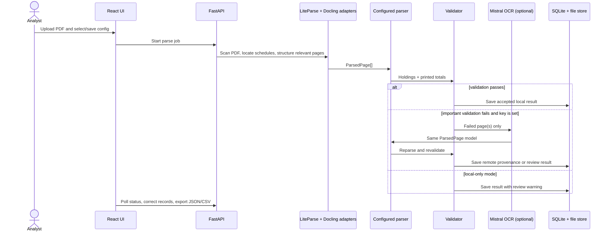

# Visual Alpha Data Parser

A configuration-driven prototype for extracting normalized Schedule of Investments holdings from mutual fund PDFs. It demonstrates the core Visual Alpha design: inexpensive local parsing is the normal path, deterministic checks decide acceptance, and Mistral OCR is called only for a failed page or the smallest useful page range.

## Architecture



Provider response types end at adapters. The parser consumes only positioned `ParsedPage` blocks and a versioned YAML `FundConfig`; there is no parser-wide fund-name branching. The included configurations cover:

- BlackRock: security type → country, security-first rows.
- GSAM: security type → country, wrapped share-first rows, sector in parentheses.
- Hartford: security type → sector, issuer carry-forward, shares-vs-principal classification.

The default lightweight local adapter uses `pdfplumber` to produce bounding-box-aware, column-ordered blocks. `LiteParseAdapter`, `DoclingAdapter`, and `MistralOcrAdapter` remain explicit boundaries so the native engines can be enabled without touching business parsing.

## Quick start with Docker

Prerequisites: Docker Desktop with Compose.

```bash
cp .env.example .env
docker compose up --build
```

Open <http://localhost:8080>. The backend API and OpenAPI UI are available at <http://localhost:8000/docs>.

PowerShell equivalent:

```powershell
Copy-Item .env.example .env
docker compose up --build
```

## Native development

Prerequisites: Python 3.12+, Node.js 20+, and npm.

```powershell
cd backend
py -3.12 -m venv .venv
.venv\Scripts\Activate.ps1
pip install -e ".[dev]"
Copy-Item ..\.env.example .env
uvicorn app.main:app --reload
```

In a second terminal:

```powershell
cd frontend
npm install
npm run dev
```

The native UI runs at <http://localhost:5173>. Uploaded documents and raw remote responses are written beneath `backend/data/` by opaque document ID, outside source folders.

## Local-only and Mistral modes

Local-only mode is the default: leave `MISTRAL_API_KEY` unset. Failed important checks remain visible for review and do not prevent application startup.

To enable page-level fallback:

1. For native development, install the optional client: `pip install -e ".[remote]"` from `backend/`. The Docker image already includes it.
2. Set `MISTRAL_API_KEY` in `.env`.
3. Restart the backend.

The adapter uses a timeout-oriented, one-retry provider boundary, records source provenance, saves the raw response under the data directory, and never logs the key or full PDF text.

### Recoverable parsing failures

The import job distinguishes recoverable extraction problems from fatal job failures:

- Common financial formats such as currency symbols, accounting parentheses, grouped spaces, and trailing minus signs are normalized before Decimal conversion.
- A malformed field or incomplete row creates a page-scoped validation item; already extracted holdings and later rows are preserved.
- Error-level page validations request remote fallback only for the affected pages when it is enabled and available.
- If remote OCR is disabled, unavailable, times out, or returns no usable pages, the local result is saved as **Complete - review required**. Holdings on affected pages are marked for review.
- The entire job is marked **Failed** only when processing cannot produce a usable result at all, such as a missing document/configuration or an unexpected storage/pipeline error.

This makes provider outages and isolated PDF noise visible and retryable without discarding otherwise valid work.

Environment variables:

| Variable | Default | Purpose |
|---|---|---|
| `DATA_DIR` | `data` | PDF, SQLite, and raw response storage |
| `DATABASE_URL` | `sqlite:///data/visual_alpha.db` | SQLAlchemy connection |
| `MISTRAL_API_KEY` | empty | Enables remote fallback when set |
| `MISTRAL_OCR_MODEL` | `mistral-ocr-latest` | OCR model identifier |
| `CORS_ORIGINS` | local UI URLs | Comma-separated allowed origins |

## Using the prototype

1. Open **Setup**, upload one supplied report, and select a saved fund configuration or use auto-detection.
2. Review/edit aliases, hierarchy, columns, and fallback policy in the configuration editor.
3. Open **Parse** and start the background job. The page counts distinguish local and remote work.
4. Open **Validation** to review document/record checks, reconciliation, provenance, and corrections.
5. Open **Output** to inspect the normalized table and download JSON or CSV.

For repeat monthly imports, reuse the saved `fund_id` and current configuration version through `POST /api/documents/{id}/parse`. If a layout changes, edit and version aliases/hierarchy once; future jobs use that version.

## Tests and quality checks

```powershell
cd backend
pytest
ruff check .
cd ..\frontend
npm run lint
npm run build
```

Tests cover number/country normalization, aliases, holding-vs-total classification, cross-page context, wrapped rows, exact Decimal reconciliation, fallback routing, all three fund styles, a fake remote retry, and preservation of local records during a remote-provider failure. The normal suite never calls Mistral or depends on confidential PDFs.

## API summary

The prototype exposes all challenge endpoints: document upload/read, asynchronous parse jobs, results and validations, record corrections, versioned configurations, and JSON/CSV exports. See `/docs` for schemas and interactive calls.

## Cost and performance choices

- The fast local scan examines the document once; table structuring is restricted to detected schedule pages.
- Saved configuration and deterministic parsing avoid per-row model calls.
- Exact Decimal checks and section totals make fallback explainable.
- Remote OCR is page-scoped and used only when an error-severity check fails.
- SQLite and background tasks keep the prototype simple; service boundaries are ready for object storage and a durable queue.

## Known limitations

- The default local compatibility backend is not native LiteParse/Docling; those provider adapters are intentionally swappable and the optional dependency group is not installed in the minimal image.
- PDF text with broken font encoding or image-only pages may require Mistral OCR.
- The parser proves useful sections from each supplied layout; it does not claim complete derivative-table coverage.
- Background tasks and SQLite are suitable for a single-node prototype. Production should use a durable queue, Postgres, object storage, malware scanning, retention policies, and concurrency controls.
- Corrections are stored with audit history. The UI offers reusable mapping updates, but a domain reviewer must decide how a one-off record correction should change a shared config.
- Remote provider SDK surface can evolve; pin and contract-test the optional Mistral integration before production deployment.

## Design rationale

Local-first plus validation-gated fallback keeps monthly processing predictable, private, fast, and inexpensive while retaining a recovery path for changed or noisy layouts. The common page model and versioned configuration are the key scalability mechanisms: providers and layouts can change independently of the holding schema, parser, validation, persistence, and UI.
